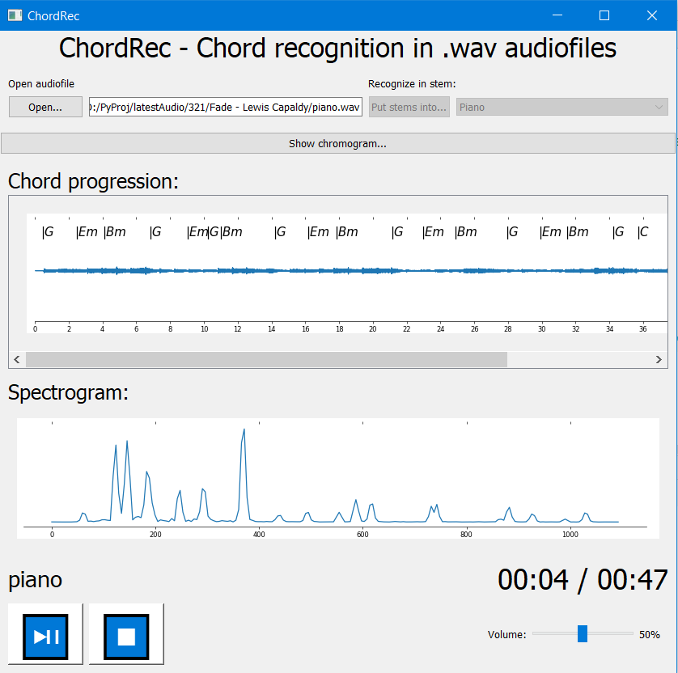

# Chord recognition with UI
## Run
Project needs the environment for  [Anaconda](https://docs.continuum.io/anaconda/install) and with [Python 3.8](https://www.python.org/downloads/release/python-3810/) to run. 
All configs you can import from ```environment.yml``` 

## Description
This app that can separate accompaniment stems using 
[**Spleeter** by **deezer**](https://research.deezer.com/projects/spleeter.html)
from music ```.wav``` audiofile and then algorithmically recognize
simple chords (major and minor triads).

You need ```.wav``` upload audiofile to the app, and it will try to recognize chords in it.

After ```Open...``` button is clicked the program will recognize simple chords.




## Chroma

Also you can see **pitch class profiles** during the time by clicking 
```Show chromogram...```


## "Spleeting" the stems
You can _separate_ audio by stems and
use **accompaniment**, **piano**, **accompaniment without drums and bass**
by choosing an option and clicking ```Put stems into...```

### Warning
First stems separation will take some time. App needs to download **pretrained models** for it
## Reference
1. If you are interested in algorythm you should consider exploring
this project: https://github.com/chenhuiyi/chord-recognition/
2. For better understanding of the topic you should read: "Design and Evaluation of a Simple Chord Detection Algorithm" by Christoph Hausner: http://www.fim.uni-passau.de/fileadmin/files/lehrstuhl/sauer/geyer/BA_MA_Arbeiten/BA-HausnerChristoph-201409.pdf